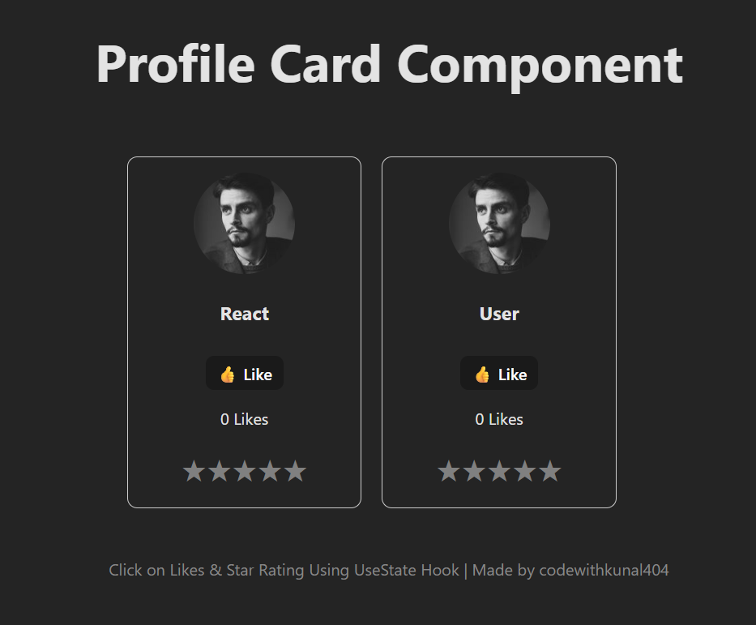

# Profile Card Component with React

A React application featuring interactive profile cards with like functionality and star rating system using React hooks (useState).



## Features

### 1. Interactive Profile Cards
- Display user profile with avatar image
- Clean and responsive card design with rounded borders
- Reusable ProfileCard component

### 2. Like System
- Toggle like/unlike functionality
- Real-time like counter
- Visual feedback with emoji (👍)
- State management using React useState hook

### 3. Star Rating Component
- Interactive 5-star rating system
- Hover effect to preview rating
- Click to set rating
- Dynamic color change (gold for selected, gray for unselected)
- Smooth user experience with hover states

## Tech Stack

- **React** 19.2.0
- **Vite** 7.3.1 - Fast build tool and dev server
- **ESLint** - Code linting
- **CSS** - Styling

## Project Structure

```
src/
├── App.jsx           # Main application component
├── ProfileCard.jsx   # Profile card with like functionality
├── Star.jsx          # Star rating component
├── App.css          # Application styles
├── index.css        # Global styles
└── main.jsx         # Application entry point
```

## Getting Started

### Prerequisites
- Node.js (v14 or higher)
- npm or yarn

### Installation

1. Clone the repository
```bash
git clone <repository-url>
cd firstapp
```

2. Install dependencies
```bash
npm install
```

3. Start development server
```bash
npm run dev
```

4. Open your browser and navigate to `http://localhost:5173`

## Available Scripts

- `npm run dev` - Start development server
- `npm run build` - Build for production
- `npm run preview` - Preview production build
- `npm run lint` - Run ESLint

## Component Usage

### ProfileCard Component
```jsx
<ProfileCard 
  name="React" 
  image="https://i.pravatar.cc/150" 
/>
```

### StarRating Component
```jsx
<StarRating />
```

## How It Works

### Like Functionality
- Uses `useState` hook to manage liked state and count
- Toggles between "Like" and "Liked" states
- Increments/decrements counter based on like status

### Star Rating
- Maps through array [1, 2, 3, 4, 5] to render stars
- Tracks rating and hover states separately
- Updates color based on current rating or hover position
- Persists rating after click

## Screenshots

Add your project screenshots in a `screenshots` folder:
- `demo.png` - Full application view
- `like-feature.png` - Like functionality demonstration
- `star-rating.png` - Star rating interaction

## Author

Made by **codewithkunal404**

## License

This project is open source and available under the MIT License.
